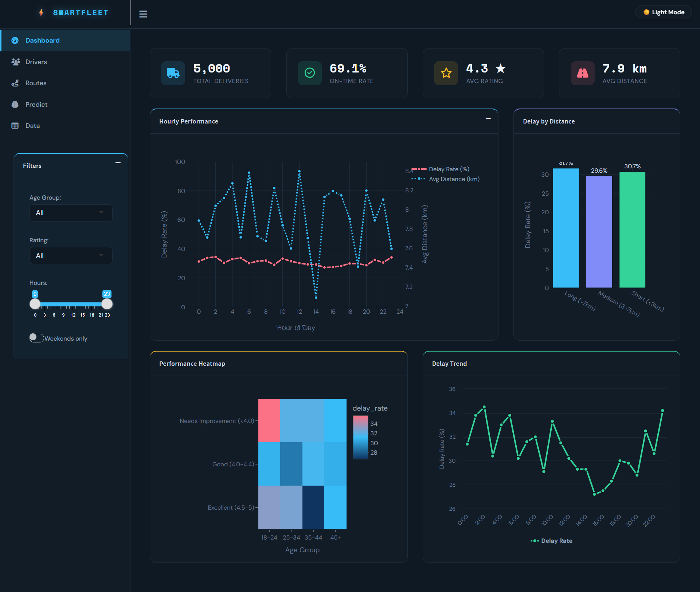
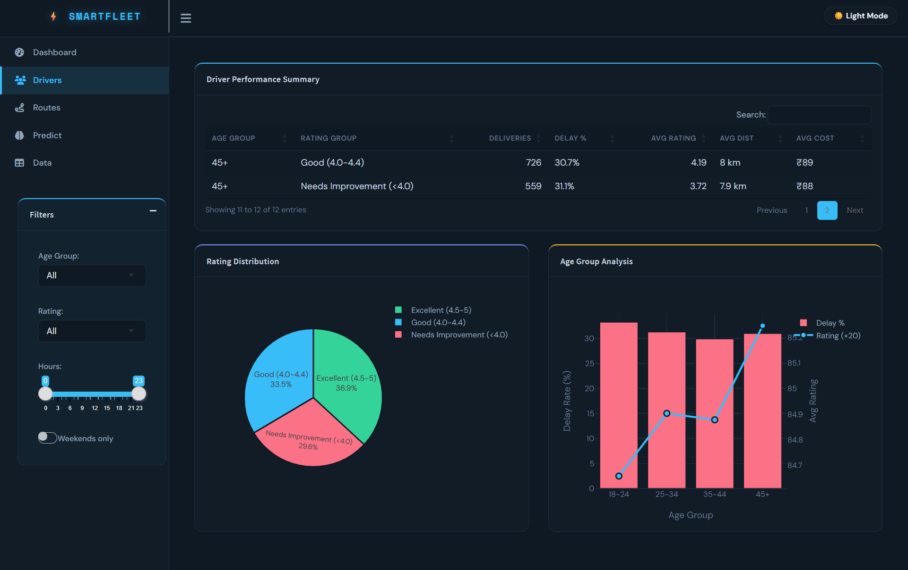
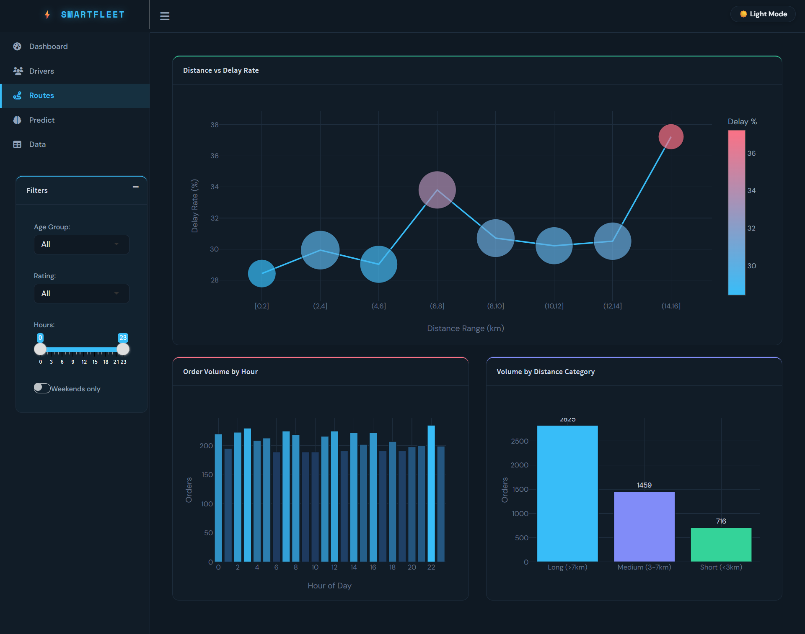
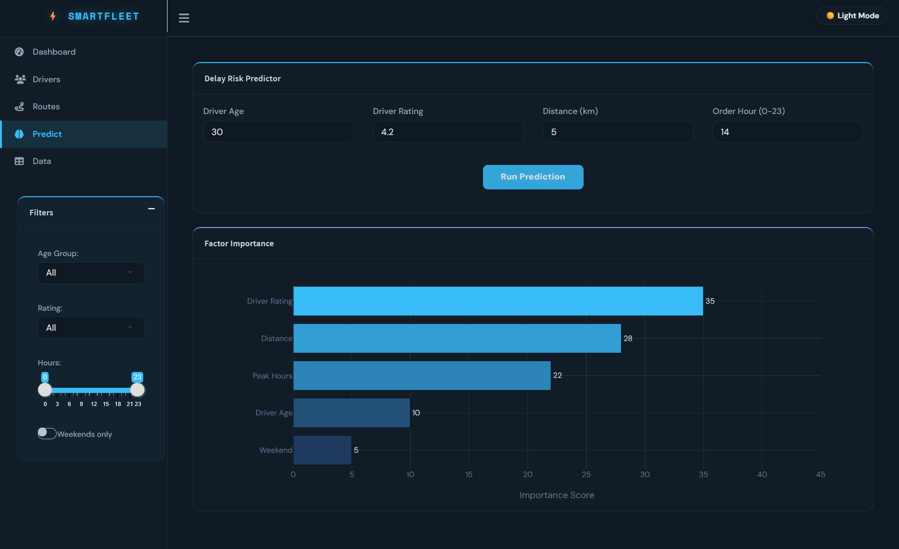
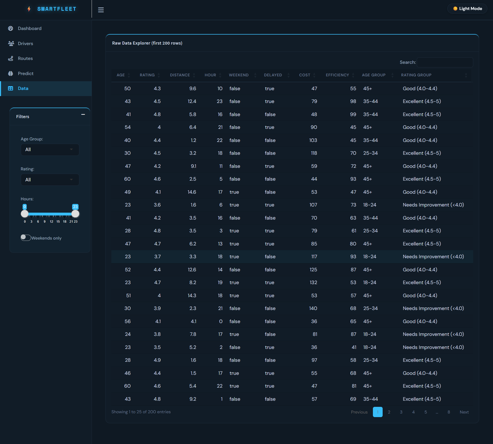

# ⚡ SmartFleet Analytics

> A professional **R Shiny** dashboard for delivery fleet performance analysis — featuring real-time KPIs, delay prediction, route intelligence, and driver analytics.

## 🌐 Live Demo

🚀 **Live Dashboard:**
https://smartfleet-analytics.shinyapps.io/smartfleetanalytics/

💻 **GitHub Repository:**
https://github.com/Krishna-0510/SmartFleet_Analytics



---

## 📋 Table of Contents

- [Overview](#-overview)
- [Features](#-features)
- [Screenshots](#-screenshots)
- [Project Structure](#-project-structure)
- [Requirements](#-requirements)
- [Installation](#-installation)
- [How to Run](#-how-to-run)
- [Data](#-data)
- [Tech Stack](#-tech-stack)

---

## 🚀 Overview

SmartFleet Analytics is a Big Data dashboard built with **R Shiny** that analyzes 5,000+ delivery records from Porter (a last-mile logistics platform). It provides actionable insights on delivery delays, driver performance, route efficiency, and cost optimization — all in a sleek dark/light-mode UI.

**Built for:** VIT University | SEM-II | Big Data Analytics Project

---

## ✨ Features

| Tab | What it does |
|-----|-------------|
| 📊 **Dashboard** | KPI cards, hourly performance charts, heatmap, delay trends |
| 👥 **Drivers** | Driver performance table, rating distribution, age group analysis |
| 🗺️ **Routes** | Distance vs delay scatter, peak hour volume, distance category breakdown |
| 🔮 **Predict** | Rule-based delay risk predictor (LOW / MEDIUM / HIGH) with factor importance |
| 📋 **Data** | Raw data explorer with search, sort, and pagination |

**Additional:**
- 🌙 Dark / ☀️ Light mode toggle
- 🔍 Sidebar filters (Age Group, Rating, Hour range, Weekends only)
- 📱 Responsive layout with collapsible sidebar

---

## 📸 Screenshots

### 📊 Dashboard


### 👥 Drivers


### 🗺️ Routes


### 🔮 Predict


### 📋 Data Explorer


---

## 📁 Project Structure

```
SmartFleetAnalytics/
│
├── 📊 data/
│   ├── raw/
│   │   ├── Porter_Data_Set.csv
│   │   ├── processed_data.csv
│   │   ├── cleaned_dataset_porter.xlsx
│   │   └── Porter_Case_Study_Results.xlsx
│   └── processed/
│
├── 🤖 model/
│
├── 📜 scripts/
│   ├── 01_data_loading.R
│   ├── 02_data_cleaning.R
│   ├── 03_feature_engineering.R
│   ├── 04_model_training.R
│   └── 05_dashboard_prep.R
│
├── 🎨 app/
│   └── app.R                  ← Main Shiny dashboard
│
├── 📚 docs/
│   └── README.md
│
├── 📋 config/
│   └── settings.R
│
├── 📸 screenshots/
│   ├── 01_dashboard.png
│   ├── 02_drivers.png
│   ├── 03_routes.png
│   ├── 04_predict.png
│   └── 05_data.png
│
└── generate_sample_data.R     ← Run this first!
```

---

## ⚙️ Requirements

- **R version:** 4.5.3 or higher
- **RStudio / VS Code** with R extension

### R Packages

```r
install.packages(c(
  "shiny",
  "shinydashboard",
  "shinyWidgets",
  "tidyverse",
  "lubridate",
  "plotly",
  "DT",
  "highcharter",
  "openxlsx",
  "readr",
  "dplyr",
  "stringr"
), repos = "https://cloud.r-project.org")
```

---

## 🛠️ Installation

**Step 1 — Clone the repo:**
```bash
git clone https://github.com/YOUR_USERNAME/SmartFleetAnalytics.git
cd SmartFleetAnalytics
```

**Step 2 — Install R packages:**
```powershell
Rscript -e "install.packages(c('shiny','shinydashboard','shinyWidgets','tidyverse','plotly','DT','highcharter','openxlsx','readr'), repos='https://cloud.r-project.org')"
```

**Step 3 — Generate sample data:**
```powershell
Rscript generate_sample_data.R
```

---

## ▶️ How to Run

### In VS Code (PowerShell terminal):
```powershell
Rscript -e "shiny::runApp('app/app.R', launch.browser=TRUE)"
```

### In R / RStudio console:
```r
shiny::runApp("app/app.R", launch.browser = TRUE)
```

The dashboard will open automatically in your browser at `http://127.0.0.1:XXXX`

---

## 📦 Data

The project uses **synthetic data** generated to mimic real Porter delivery data:

| File | Description | Rows | Columns |
|------|-------------|------|---------|
| `Porter_Data_Set.csv` | Raw delivery orders with GPS, weather, vehicle | 5,000 | 14 |
| `processed_data.csv` | ML-ready features (traffic, distance, delay) | 5,000 | 11 |
| `cleaned_dataset_porter.xlsx` | Cleaned orders with time features | 5,000 | 20 |
| `Porter_Case_Study_Results.xlsx` | Enhanced with cost, efficiency, delay metrics | 5,000 | 26 |

**Key stats from generated data:**
- 📦 Total Records: 5,000
- 📅 Date Range: Jan 2023 – Jun 2024
- ⏱️ Avg Delivery: ~29.7 minutes
- 🚦 Delay Rate: ~42.3%
- 💰 Avg Cost: ₹58.49
- 📏 Avg Distance: 6.80 km

---

## 🛠️ Tech Stack

| Technology | Purpose |
|------------|---------|
| **R 4.5.3** | Core language |
| **Shiny** | Web application framework |
| **shinydashboard** | Dashboard layout |
| **shinyWidgets** | Enhanced UI components |
| **plotly** | Interactive charts |
| **highcharter** | Trend line charts |
| **DT** | Interactive data tables |
| **tidyverse** | Data manipulation |
| **openxlsx** | Excel file handling |

---

## 👨‍💻 Author

**VIT University — Big Data Analytics**
 | 2025–2026

---

## 📄 License

This project is for academic purposes only.
